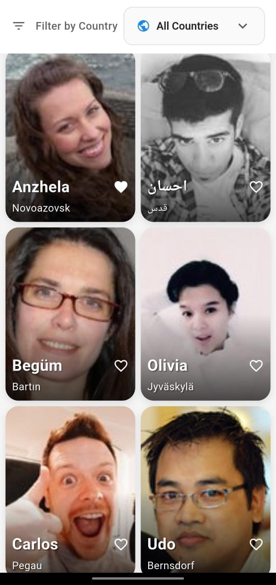

# 🌍 Profile Explorer App

A **Flutter Developer Task Project** — Profile Explorer App built using **Flutter + Provider (MVVM Architecture)**.  
This app fetches real random user data from an API and displays it beautifully with animations, transitions, and responsive design.

---

## 🖼️ Design Reference
- **Figma Design:** [Profile Explorer Design](https://www.figma.com/design/dhca1wiW8Bk3jn8tfOYl0f/Home-page?node-id=0-1&p=f&t=2Dcl2PCv3DetKJzx-0)
- **Sample Image:** [Random User Portrait](https://randomuser.me/portraits/men/51.jpg)

---

## 🔗 API Endpoint
Using the **Random User API**  
> https://randomuser.me/api/?results=20

This returns 20 random user profiles.

**Key Fields Used:**
- `name.first`
- `picture.large`
- `dob.age`
- `location.city`
- `location.country`

---

## 🏗️ Architecture
The app follows the **MVVM (Model–View–ViewModel)** pattern with a clean separation of layers:
```
lib/
 ┣ data/
 ┃ ┣ models/       → UserModel
 ┃ ┗ services/     → ApiService
 ┣ viewmodel/      → ProfileViewModel
 ┣ view/
 ┃ ┣ screens/      → HomeScreen, ProfileDetailScreen
 ┃ ┗ widgets/      → ProfileCard, AnimatedHeart, etc.
```

**State Management:** `Provider`  
**UI Structure:** Responsive layouts with `LayoutBuilder`

---

## 📱 Features

### 🏠 Home Screen
- Fetches & displays profiles in a **responsive grid layout**
- Each card shows:
  - Profile image  
  - Name  
  - Age  
  - Location  
  - Heart icon (like/dislike)
- Vertically scrollable with **pull-to-refresh**
- Handles **loading** and **error** states gracefully

### 👤 Profile Detail Screen
- Opens via image tap using **Hero animation**
- Displays:
  - Large profile image  
  - Name, Age, Location  
  - Heart icon with **animated like toggle**
- **State sync:** Liked profiles stay consistent between Home and Detail screens

---

## 🧩 Bonus Features Implemented
✅ Heart icon animation  
✅ Hero transition between screens  
✅ Filter users by country  
✅ Pull-to-refresh functionality  
✅ Fully responsive layout (mobile, tablet, desktop)

---

## ⚙️ Tech Stack
- **Language:** Dart  
- **Framework:** Flutter  
- **State Management:** Provider  
- **Architecture:** MVVM / Clean Architecture  
- **Networking:** `http` package (via ApiService)  
- **Animations:** Implicit & explicit (Hero, Scale)  

---

## 🚀 How to Run
1. Clone this repository:
```bash
   git clone https://github.com/hashmi09zx/profile_explorer_app.git
   cd profile_explorer_app
```

2. Get dependencies:
```bash
   flutter pub get
```

3. Run the app:
```bash
   flutter run
```

---

## 📸 Screenshots

| Home Screen | Profile Detail Screen |
|-------------|----------------------|
|  |  |

---

## 🧠 Learnings
- Implemented clean MVVM architecture in Flutter
- Integrated REST API with model parsing
- Managed shared state using Provider
- Built responsive layouts with animations and transitions

---

## 💬 Contact
**Developer:** Abdullah Hashmi  
📧 [abdullahhashmi24012006@gmail.com](abdullahhashmi24012006@gmail.com)  
🌐 [LinkedIn](https://www.linkedin.com/in/abdullah-hashmi-09zx/) | [GitHub](https://github.com/hashmi09zx)


---

⭐ **If you like this project, give it a star on GitHub!**